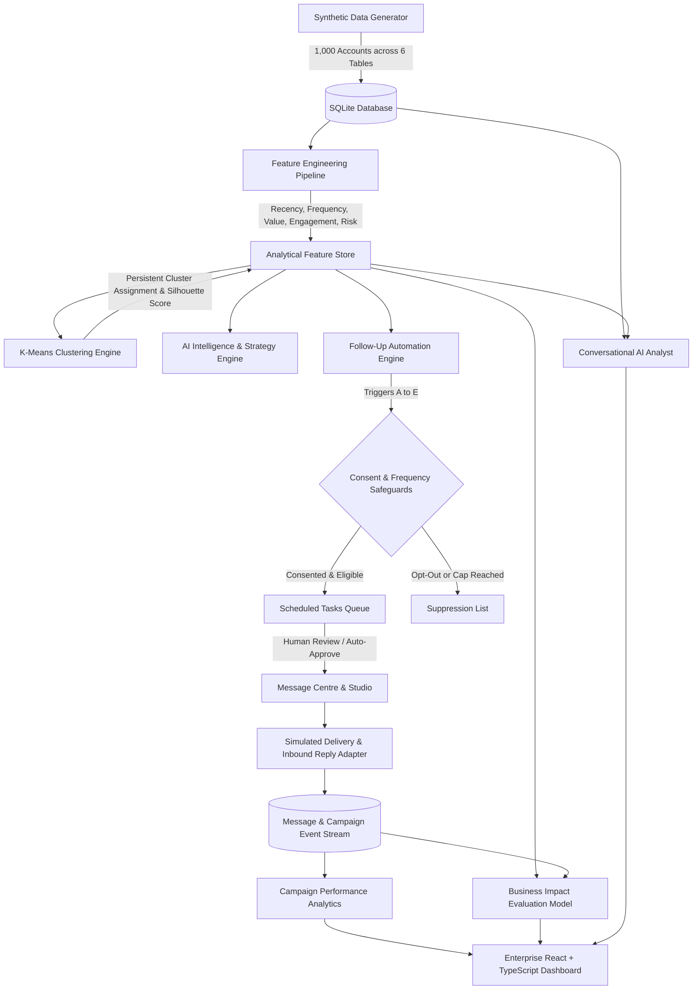

# i95Dev AI-Powered Customer Intelligence & Automated Follow-Up Platform

An enterprise-grade B2B customer intelligence and follow-up automation platform engineered for **i95Dev** (B2B digital commerce and ERP integration services). The platform discovers actionable behavioral client segments from transaction, CRM, sales interaction, and support data, provides evidence-grounded AI recommendations, generates verified multi-channel messages (Email & WhatsApp), simulates client delivery and inbound replies, and compares business impact against traditional firmographic baselines.

---

## 1. System Architecture



---

## 2. Core Capabilities & Modules

### 1. Executive Intelligence Overview
- Real-time KPI summaries: Total accounts, qualified prospects, active pipeline value ($M), realized billings ($M), simulated outreach volume, response rates, and conversion metrics.
- Global territorial and vertical filtering (Region, Industry, Assigned Account Manager).
- Behavioral segment distribution charts and pipeline concentration visualizers.
- Priority attention queue flagging accounts with high retention friction or stalled proposals.

### 2. Customer Intelligence Directory
- Directory of all 1,000 accounts with instant text search and multi-attribute filters.
- **Customer 360-Degree Modal Drawer**: Complete chronological audit trail spanning:
  * Master firmographics, consent statuses, and assigned account executives.
  * Historical contracts and billings records.
  * Sales touchpoint history (discovery calls, demos, reviews, email replies).
  * Technical support tickets with resolution turnaround and CSAT ratings.
  * Active pipeline opportunities and sales stages.
  * Simulated outreach history and customer replies.
  * Actionable AI Recommended Next Action.

### 3. Behavioral Segmentation Engine
- Scikit-learn **K-Means clustering** with dynamic `k` slider (3 to 8 clusters).
- Real-time **Silhouette Score** calculation to measure mathematical cluster separation.
- Automatic data-driven label assignment:
  * *High-Intent Prospects*
  * *Engaged Growth Accounts*
  * *Stalled Opportunities*
  * *Existing Clients - Expansion Potential*
  * *Retention & Support Risk*
- **Behavioral vs. Firmographic Comparison Matrix**: Cross-tabulation proving that every industry vertical contains accounts across all behavioral personas, explaining why traditional firmographic blasts fail.

### 4. Grounded AI Strategy Engine
- Dedicated structured intelligence cards for every segment:
  * Executive description and defining traits.
  * Key variances from other segments.
  * Supporting calculated metrics.
  * Testable customer need hypotheses.
  * Differentiated marketing strategies and tactical sales actions.
  * Recommended communication channel and follow-up timing.
  * Cross-sell / up-sell opportunities and critical cautions.
  * Measurable success metrics.
- Uses Gemini API when `GEMINI_API_KEY` is present; falls back to an evidence-grounded deterministic expert reasoning system when offline.

### 5. Follow-Up Automation Engine
- Configurable rule-based triggers:
  * **Trigger A**: High-Intent Proposal Follow-Up (proposal sent, > delay_days, no response, deal open).
  * **Trigger B**: Stalled Opportunity Re-engagement (open deal idle for >= 21 days).
  * **Trigger C**: Meeting / Demo Follow-Up (demo completed, recap scheduled within 48h).
  * **Trigger D**: Existing Client Expansion (active client, CSAT >= 4.0, zero open tickets).
  * **Trigger E**: Retention & Support Escalation (open tickets >= 2 or CSAT < 3.0; suppresses promotional sales outreach immediately).
- Configurable delays, preferred channels, max attempts, minimum intervals, and daily limits.
- Human review gates: Approve, Reject, or Edit messages before dispatch.
- **Idempotency Guarantee**: Multiple runs never create duplicate tasks.

### 6. Personalized Message Centre & Delivery Simulator
- Channel-specific templates for **Email** and **WhatsApp**.
- Populates recipient and company names, assigned AM, and verified CRM facts.
- **Delivery Lifecycle Simulator**:
  * `Queued` &rarr; `Scheduled` &rarr; `Sent (simulated)` &rarr; `Replied (simulated)` &rarr; `Converted (simulated)`
- Interactive response controls: simulate Positive, Neutral, Negative, or Opt-Out responses on any message.
- Batch inbound response simulator.

### 7. Campaign Performance Analytics
- Comprehensive funnel tracking: messages queued, sent, replied, converted, suppressed, opted-out.
- Channel comparison: Email vs. WhatsApp performance.
- Conversion by trigger type and behavioral segment.
- 14-day execution and conversion timeline.

### 8. Conversational AI Analyst
- Conversational chat interface answering questions against the live SQLite database.
- Provides natural language explanations alongside data tables and key takeaways.
- Handles queries on stalled opportunities, project values, recent disengagements, prioritization, and firmographic comparison.

### 9. Business Impact & Strategy Evaluation Model
- Side-by-side comparison of **Baseline Strategy** (Firmographic blast) vs. **Proposed AI Strategy** (Behavioral triggers).
- Evaluates coverage, time-to-touch, response rate, conversion rate, converted pipeline value, workload volume, and workload efficiency ($/message).
- Documented simulation model with fixed random seeds (seed 42) for reproducible experimentation.

### 10. Data Architecture & Governance
- Complete relational inspection across all 6 linked tables.
- One-click CSV downloads for every dataset.
- Interactive Data Dictionary.
- Synthetic Dataset Generator (custom seed and account count).
- Automated Database Health & Schema Validation Suite (foreign key integrity, null checks, vector completeness).

---

## 3. Technology Stack

- **Frontend**: React 18, TypeScript, Tailwind CSS, Lucide Icons, Recharts.
- **Backend**: Python 3.14+, FastAPI, SQLite 3, APScheduler.
- **Data Science & ML**: Pandas, NumPy, Scikit-learn (KMeans, StandardScaler, Silhouette Score).
- **Tooling**: Vite 5, Node.js 20+, Pytest.

---

## 4. Setup & Running Locally

### Prerequisites
- Python 3.10+ (installed on system)
- Node.js 18+ and npm

### Step 1: Start the Backend Server

```bash
cd backend
# Optional: create a virtual environment
# python -m venv venv
# source venv/bin/activate (or venv\Scripts\activate on Windows)

pip install -r requirements.txt

# Start FastAPI server on port 8000
python -m uvicorn app.main:app --host 0.0.0.0 --port 8000 --reload
```

The backend starts at `http://localhost:8000`.
- API Documentation (Swagger): `http://localhost:8000/docs`
- Health check: `http://localhost:8000/api/health`

### Step 2: Start the Frontend Application

```bash
cd frontend
npm install
npm run dev
```

The frontend will run at `http://localhost:3000` with automated API proxying to `http://localhost:8000`.

---

## 5. Automated Unit Tests

The backend includes test coverage validating feature engineering, clustering quality, trigger evaluation, idempotency, consent suppression, and simulation lifecycles.

```bash
cd backend
python -m pytest tests/test_pipeline.py -v
```

### Test Results
```
tests/test_pipeline.py::test_feature_engineering PASSED                  [ 16%]
tests/test_pipeline.py::test_clustering_execution PASSED                 [ 33%]
tests/test_pipeline.py::test_trigger_evaluation_and_idempotency PASSED   [ 50%]
tests/test_pipeline.py::test_suppression_and_consent_rules PASSED        [ 66%]
tests/test_pipeline.py::test_data_validation_suite PASSED                [ 83%]
tests/test_pipeline.py::test_simulation_lifecycle PASSED                 [100%]
============================== 6 passed in 3.15s ==============================
```

---

## 6. Safety & Compliance Controls
1. **Prototype Isolation**: All recipient emails (`@example-b2b.com`), phone numbers (`+1-555-01XX`), and companies are synthetic. No live emails or SMS are sent.
2. **Channel Consent Checks**: Messages are only generated for recipients with active channel consent (`consent_email = 1` or `consent_whatsapp = 1`).
3. **Global Suppression**: Opted-out contacts are permanently suppressed from future outreach.
4. **Frequency Capping**: Maximum attempts and minimum inter-message delays prevent duplicate or aggressive outreach.
5. **Retention Safeguards**: Accounts experiencing technical service strain have all promotional sales messaging suppressed automatically.
